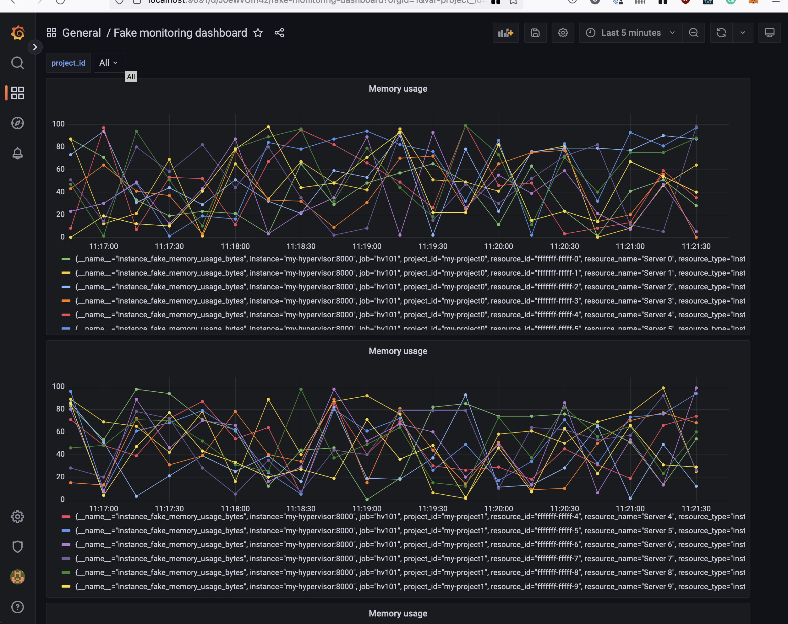

# What is

Infrastructure example of prometheus + prometheus remote write + grafana to add monitoring of a simple Python application.

# Instructions

Run `make` to start four containers:

* `prometheus` to store metrics
* `grafana`
* `prometheus-writer` which reads data exposed by `my-hypervisor` and remote writes to `prometheus`
* `my-hypervisor`, a simple Python app exposing metrics

#### Datasource

To configure the prometheus datasource, go to grafana at http://localhost:9091/datasources and set the URL to `http://prometheus:9090`.

#### Dashboard creation

Create a new dashboard. From settings, go to `variables`, set:

* `name` to `project_id`
* `query` to `label_values(instance_fake_cpu_seconds_total, project_id)`. The first parameter is the metric to extract the project id from, the second is the field to display in the select box.
* set `include all option`

From the dashbaord configuration:

* set metric to `instance_fake_memory_usage_bytes`, and set the label `project_id` to the variable `$project_id`
* configure the repeat option to use `project_id`

